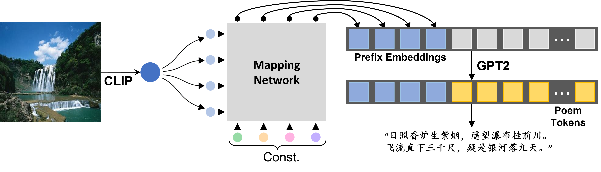

# Image-to-Poem
9.28之前可能会忙于升学，本项目暂不更新。<font color=red>**<u>希望可以在10.31号之前完成这个项目的全部功能。</u>**</font>

## 1. 项目介绍
图像生成古诗(Image to Poem)，旨在为给定的图像自动生成符合图像内容的古诗句。

使用对比学习预训练的[CLIP模型](https://github.com/openai/CLIP)拥有良好的迁移应用和zero-shot能力，是打通图像-文本多模态的重要模型之一。
本项目使用CLIP模型生成古诗意象关键词向量和图像向量。


由于古诗的特殊性，本项目重头训练了一个用于生成古诗文的Language Model，尝试了T5 model和GPT2 model，暂时认为T5 model的效果更佳(使用模型的参数量也更大)，现公开该预训练模型以供使用。

**以上模型均可通过调用 https://github.com/huggingface/transformers 的`transformers`导入**。

模型预训练参数下载：

| 模型名称              | 下载地址                                                                                            | 参数量  |
|-------------------|-------------------------------------------------------------------------------------------------|------|
| CN-CLIP(ViT-B/16) | [download](https://drive.google.com/drive/folders/1zPgpXL-2WZ8vzKmyaHb5-jff8XaHwSRv?usp=sharing) | 188M |
| T5                | [download](https://drive.google.com/drive/folders/1zPgpXL-2WZ8vzKmyaHb5-jff8XaHwSRv?usp=sharing) | 223M  |
| GPT2              | [download](https://drive.google.com/drive/folders/1zPgpXL-2WZ8vzKmyaHb5-jff8XaHwSRv?usp=sharing) | 118M  |

其他版本的CN-CLIP可从下面`引用和致谢`的第二条链接中获取，或是去HuggingFace官网查询。

## 2. 引用和致谢
在项目完成期间，我参考并使用了以下项目，这里表示感谢！
* 数据集来源：https://github.com/THUNLP-AIPoet/CCPM
* CLIP预训练模型来源： [Chinese-CLIP: Contrastive Vision-Language Pretraining in Chinese](https://github.com/OFA-Sys/Chinese-CLIP)
* GPT2预训练部分代码：https://github.com/Morizeyao/GPT2-Chinese

## 3. 使用说明和生成样例
### 安装依赖库
```commandline
pip3 install torch torchvision torchaudio
pip install transformers
pip install tqdm matplotlib
```
如果希望尝试预训练语言模型, 建议安装`torch+cudaxx.x`的GPU版本。

### 快速体验古诗生成
```commandline
python img2poem.py --image_path ./datasets/images/feiliu.jpg --model_type T5 --model_path ./config/t5_config
```
其中：
* `--image_path`: 图片所在位置
* `--model_type`: 模型名称,目前可选用'T5','GPT2'
* `--model_path`: 模型所在文件夹

### 生成样例

````
白苹洲渚流，丹青未有人。水林壑夜深，乱峰高几重。 	
仙人问道踪，壑深自坐禅。丹青一片云，月随风水林。 	 
何处丹青眼，青山半落霞。水林昼景风，诸君自有闲。	 
不见青林路，却忆庐陵西。老松犹未分，钟山水似难。
飞鹤度湖山，青松半掩关。丹壑千人在，犹记林水心。	
````


````
犹自在藏新，不知是旧人。暮天三百年，桃源一片春。
数年三两枝，却羡玉龙飞。桃源水一津，斜晖又一年。	
却见斜阳里，桃源几度花。一曲龙惊散，谁似玉皇家。
千骑鹤归飞，一曲茅亭去。天上桃源路，玉龙归白杳。
相逢一笑飞，知有桃源人。何如写玉龙，斜晖送晚风。
````


````
萧然见山来，却恐归来晚。时见布泉飞，锦囊深掩门。
时有一花村，俗人如此山。月溪风乱鸣，时有瀑布还。
月明闲送风，瀑布飞仙雪。人间几度林，锦衣还说天。 
一曲溪桥过，瀑布人应在。留住锦囊经，飞泉上流尘。
谁人识此中，布泉老客行。月满江来路，不须频为谁。
````

## 4. 文件结构
````
│  img2poem.py      # 生成古诗的文件
│  README.md
│
├─config
│  ├─Chinese_CLIP   # CLIP模型权重下载位置
│  ├─gpt_config     # GPT2模型权重下载位置
│  └─t5_config      # T5模型权重下载位置
├─datasets
│  │  keywords.txt              # 古诗意象关键词
│  │  keywords_dict.pt          # 古诗意象关键词及对应的CLIP text encode
│  │
│  ├─CCPC                       # 古诗数据集
│  └─images
│          feiliu.jpg           # 测试图片
│
├─data_process
│      dataset.py               # dataloader, 但不支持其他数据集, 需要自行编写
│      vocab.py                 # 构造词表和字典
│      __init__.py
│
└─pretrain
        gpt2pretrain.py         # GPT2模型的预训练
        gpt_generate.py         # GPT2模型生成古诗demo
        t5generate.py           # GPT2模型生成古诗demo
        t5pretrain.py           # T5模型的预训练
        trainer.py
        __init__.py
````

## 5. 一些解释
* 对于当前项目的评价
> 提取关键词进行古诗生成是一个**损失信息**的过程，尤其是将图像映射到关键词的操作，损失了图像原本的语义(例如只能识别人，而不知道人在做什么)。所以效果上来看仍然差强人意。
>
> 没有给模型一些关于韵律、题材、体裁等的设定，导致不够专业。
* 可不可以使用自己的古诗数据集尝试预训练？
> 可以，不过由于CCPM数据集是`.json`文件格式,导入方式与`.txt`不同。所以在`datasets.py`文件里你需要重新写一下有关文件导入的部分。并且由于预训练方法多样，你也可以修改预训练时的一些策略。

* 项目的预训练方法是什么？
> 首先对于GPT2模型，常规预训练方法就是自回归，本项目尝试了mask关键词的方法，例如：
>
>`[CLS]关键词：明月 故乡 [EOS] 举头望明月，低头思故乡[SEP]` => `[CLS]关键词：明月 故乡 [EOS] 举头望[MASK][MASK]，低头思[MASK][MASK][SEP]`
> 
> 然后我额外对这些mask token的预测准确率进行了计算，加入了损失函数中。
> 
> 对于T5模型，由于是encoder-decoder架构，我使用下列格式创建数据：
> 
> x = `[CLS]关键词：红豆 南国 发 愿君[EOS][SEP]`, y = `[CLS]红豆生南国[EOS][SEP]`
> 
> x = `[CLS]关键词：红豆 南国 发 愿君[EOS]红豆生南国[EOS][SEP]`, y = `[CLS]秋来发故枝[EOS][SEP]`
> 
> x = `[CLS]关键词：红豆 南国 发 愿君[EOS]红豆生南国[EOS]秋来发故枝[EOS][SEP]`, y = `[CLS]愿君多采撷[EOS][SEP]`
> 
> x = `[CLS]关键词：红豆 南国 发 愿君[EOS]红豆生南国[EOS]秋来发故枝[EOS]愿君多采撷[EOS][SEP]`, y = `[CLS]此物最相思[EOS][SEP]`

* 通过什么方式进行图像生成古诗？未来有什么进一步更新的方法？
> 现在的实现比较简单，就是先搜集一个闭环的关键词数据集(`keyword.txt`)，然后使用CLIP对图像和所有关键词进行编码，计算它们之间的相似度，取相似度最高的K个关键词，然后放置于语言模型进行生成。
>
> 由于`图像-古诗对`数据集非常匮乏，似乎暂时做不到删去这个闭环关键词数据集。未来如果有充足的数据集，我会使用`CLIP-MappingNet-T5/GPT2`的模型架构进行训练，例如下图的[CLIPCap](https://arxiv.org/pdf/2111.09734.pdf)架构：
> 


未来有古诗生成图像的想法，待进一步更新。现有的可以进行古诗生成图像的项目有：https://huggingface.co/IDEA-CCNL/Taiyi-Diffusion-532M-Nature-Chinese
